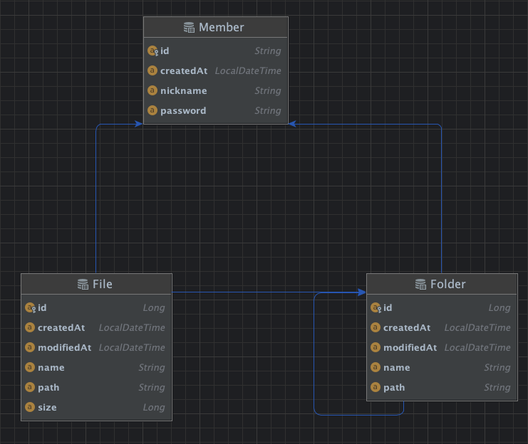

# MYBOX 서비스 서버개발

## 아키텍처
### 서비스 아키텍처


### CI 환경 아키텍처


## 배포 프로세스


## API 목록

<details>
<summary> 회원 가입 API </summary>
<div markdown="1">

- method: POST
- url: /api/v1/members
- request
   ```
  {
      "id": "test_id",
      "password": "test1234!@",
      "nickname": "테스트"
   }
  ```
- response
   ```
  {
      "success": true,
      "errorCode": "00000000",
      "content": "test_id"
   }
  ```
  ```
  {
      "success": false,
      "errorCode": "MBER0001",
      "content": "Member who already exists."
   }
  ```
</div>
</details>

<details>
<summary> 로그인 API </summary>
<div markdown="1">

- method: POST
- url: /api/v1/login
- request
   ```
  {
      "id": "test_id",
      "password": "test1234!@"
   }
  ```
- response
   ```
  {
      "jwt": "strings"
   }
  ```
    ```
  {
      "success": false,
      "errorCode": "MBER0003",
      "content": "Password is invalid."
   }
  ```
</div>
</details>

<details>
<summary> 회원정보 조회 API </summary>
<div markdown="1">

- method: GET
- url: /api/v1/member
- request
   ```
  {
  }
  ```
- response
   ```
  {
      "id": "test_id",
      "nickname": "jaeseok-go",
      "usage": {
                  "B": "14873015",
                  "KB": "14524.428710",
                  "MB": "14.184012",
                  "GB": "0.013851"
                }
   }
  ```
  ```
  {
  "success": false,
  "errorCode": "MBER0002",
  "content": "Member is not found."
  }
  ```
</div>
</details>

<details>
<summary> 폴더 생성 API </summary>
<div markdown="1">

- method: POST
- url: /api/v1/members
- request
   ```
  {
      "id": "strings",
      "password": "strings"
   }
  ```
- response
   ```
  {
      "id": "strings",
      "password": "strings"
   }
  ```
</div>
</details>

<details>
<summary> 폴더 삭제 API </summary>
<div markdown="1">

- method: POST
- url: /api/v1/members
- request
   ```
  {
      "id": "strings",
      "password": "strings"
   }
  ```
- response
   ```
  {
      "id": "strings",
      "password": "strings"
   }
  ```
</div>
</details>

<details>
<summary> 자식 파일/폴더 조회 API </summary>
<div markdown="1">

- method: POST
- url: /api/v1/members
- request
   ```
  {
      "id": "strings",
      "password": "strings"
   }
  ```
- response
   ```
  {
      "id": "strings",
      "password": "strings"
   }
  ```
</div>
</details>

<details>
<summary> 파일 업로드 API </summary>
<div markdown="1">

- method: POST
- url: /api/v1/members
- request
   ```
  {
      "id": "strings",
      "password": "strings"
   }
  ```
- response
   ```
  {
      "id": "strings",
      "password": "strings"
   }
  ```
</div>
</details>

<details>
<summary> 파일 다운로드 API </summary>
<div markdown="1">

- method: POST
- url: /api/v1/members
- request
   ```
  {
      "id": "strings",
      "password": "strings"
   }
  ```
- response
   ```
  {
      "id": "strings",
      "password": "strings"
   }
  ```
</div>
</details>

<details>
<summary> 파일 삭제 API </summary>
<div markdown="1">

- method: POST
- url: /api/v1/members
- request
   ```
  {
      "id": "strings",
      "password": "strings"
   }
  ```
- response
   ```
  {
      "id": "strings",
      "password": "strings"
   }
  ```
</div>
</details>

<details>
<summary> 폴더 다운로드 API </summary>
<div markdown="1">

- method: POST
- url: /api/v1/members
- request
   ```
  {
      "id": "strings",
      "password": "strings"
   }
  ```
- response
   ```
  {
      "id": "strings",
      "password": "strings"
   }
  ```
</div>
</details>

## ERD


## 성능테스트 결과

## 기술적 고민 포인트 (+개선)
### 설계
- 테이블 설계
1. 일단 테이블 설계를 폴더 - 파일 - 부모 - 회원 테이블로 정규화했다.
2. 쿼리 성능을 고려하여 부모 테이블에 path 컬럼을 추가했다.
3. 폴더와 파일 테이블을 하나의 테이블로 합치고 구분지을 수 있는 컬럼을 추가하는 방법도 있고 이 방향에 대한 가능성도 열어두었다.
   (두 테이블은 비슷한 속성을 가짐)


- 도메인 설계
1. 각각 책임을 가지게 될 도메인 클래스를 폴더 - 파일 - 회원으로 설계했다.


도메인을 설계하여 최대한 객체지향적으로 개발하고 싶었는데, 테이블 설계와 도메인 설계가 딱 맞아떨어지지 않아 혼란스러웠다.

<br>


일단 이 부분에서는 도메인 설계에 조금 더 중점을 두어 폴더 - 파일 - 회원으로 설계하게되었다.

그 이유로는

1. 레퍼런스 상 일반적으로 많이 사용하는 방식은 테이블 설계로 추출된 엔티티 클래스를 도메인 클래스로 활용하는 방식이었다.
2. 도메인과 엔티티를 구분하지 않을 것이라면, 도메인 설계를 따르는게 테이블 설계 관점에서 어느정도 타협할 수 있는 부분이라는 생각이 들었다. 
3. 테이블 설계에 대한 고민은 다른 프로젝트에서도 충분히 느꼈다고 생각했고, 도메인 기반의 설계를 바탕으로 개발을 하며 여러 문제에 부딪혀보고 싶었다.

이렇게 설계를 하고 개발을 하며 오히려 DDD와 OOP에 대한 의문점이 많이 남게되었다.

Layerd Architecture에서는 영속성관리를 Repository에서 수행하게되고, 이에 대한 의존성을 Service가 가지기 때문에 도메인(엔티티) 클래스가 모든 로직을 가지는 데에는 한계가 있었다.  또한, 성능을 위해서 네이티브 쿼리를 작성해야하는 경우에는 쿼리에 로직이 들어가는 경우가 있었다.

이처럼 하나의 요청에 대한 비즈니스 로직이 도메인/서비스/쿼리로 분산되는 케이스가 발생하여 굉장히 혼란스러웠다.

이 부분은 현재 읽고 있는 "오브젝트" 도서를 완독하고, "클린 아키텍쳐"를 참고하여 공부해나가야 할 것 같다.